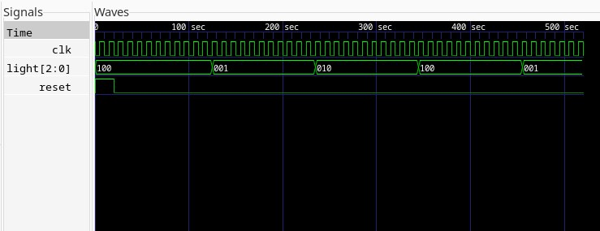

# Контроллер светофора на базе FSM (Verilog)

## Описание проекта
Данный проект представляет собой RTL-модель контроллера светофора, реализованную на языке Verilog. Логика управления построена на основе **конечного автомата Мура** (Moore Finite State Machine). 

Проект демонстрирует навыки проектирования цифровой логики, работы с состояниями и проведения функциональной верификации устройства.

## Технические характеристики
* **Язык описания аппаратуры:** Verilog HDL.
* **Тип автомата:** Автомат Мура (выход зависит только от текущего состояния).
* **Состояния системы:**
    * `S_RED` (Красный): `100`
    * `S_YELLOW` (Желтый):`010`
    * `S_GREEN` (Зеленый):`001`
* **Синхронизация:** Положительный фронт тактового сигнала (`posedge clk`).
* **Сброс:** Асинхронный сигнал высокого уровня (`reset`).

## Состав проекта
* `traffic_light.v` — основной RTL-модуль с описанием логики переходов и состояний.
* `tb_traffic_light.v` — тестовое окружение (Testbench) для генерации сигналов и проверки работы.
* `Makefile` — скрипт для автоматизации процесса сборки и запуска симуляции.
* `waveforms.png` — скриншот временных диаграмм из симулятора.

## Инструментарий (Linux-стек)
Для разработки использовался свободный стек ПО (ОС Manjaro Linux):
1. **Icarus Verilog** — компиляция Verilog кода и запуск симуляции.
2. **GTKWave** — анализ полученных временных диаграмм (VCD файлы).

## Результаты моделирования
Функциональная симуляция подтвердила корректность RTL-кода. На временных диаграммах ниже видно, что после деактивации сигнала `reset` контроллер переходит в циклическое переключение фаз через заданные интервалы времени (10 тактов).



## Инструкция по запуску
Для автоматического запуска (при наличии установленных инструментов - iverilog и gtkwave) выполните в терминале:
```bash
make
